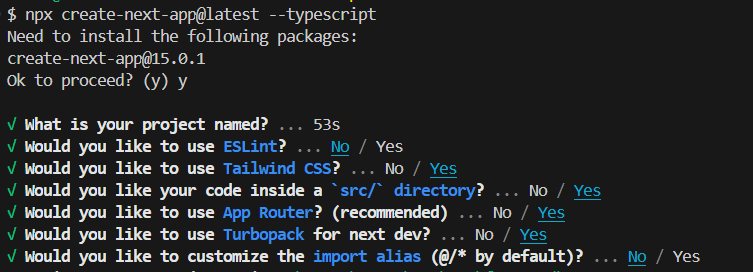

## 2024.10.30 데일리 커밋

## 1. 오늘 할 일
#### (1) 피그마 보면서 수정해야할 부분 수정
#### (2) Next.js 공부
## 0. Next.js를 사용하는 이유

### (1) Next.js란?

<aside>
💡

Next.js는 Node.js를 기반으로 만들어진 오픈소스 웹프레임워크이며, 리액트 앱의 SSR(Server-Side Rendering)과 SSG(Static Site Generation)를 지원한다고 한다. 뿐만 아니라 자동 코드 분할, CSR(Client-Side Rendering), SSR(Server-Side Rendering), 고성능 웹을 구축하기 위한 최적화와 기능들을 제공한다고 한다.

</aside>

- SSR을 지원한다
- 라우팅이 간편하게 되어 있다

### (2) 장점은?

- 향상된 성능의 SEO(검색 엔진 최적화)
- 페이지 로딩 시간이 더 빨라짐(특히 동적 데이터와 API를 지원하는 경우에는 더 좋은 서포팅이 된다!)
- CSS, images, 그리고 다른 assets가 포함된 내장 도구를 지원하면서 보다 간편화된 개발 경험을 제공

## 1. node 설치

### node version: `v20.15.0`

## 2. Next.js 설치

<aside>
💡

Next.js에 typescript를 사용하기로 함

</aside>

### (1) 터미널에 아래 명령을 입력한다.

```python
npx create-next-app@latest --typescript
```

### (2) 그럼 아래와 같은 질문들이 뜬다.



- 위 사진과 같이 설정을 해두었다.
- ESLint는 사용하지 않고, Tailwind CSS는 사용이 쉬워서 Yes로 해두었다
- src/ directory가 익숙해서 저것도 Yes로 했다
- Turbopack은 Next.js의 `pages` 및 `app` 디렉토리에서 더 빠른 로컬 개발을 위해 사용할 수 있음 → Turbopack은 모든 변환 및 최적화를 위해 SWC 컴파일러를 사용하므로, 단일 스레드에서 Babel보다 20배 빠르고 4개 코어에서 70배 빠름
- import문을 customize하는건 너무 복잡해보여서 pass ㅎ