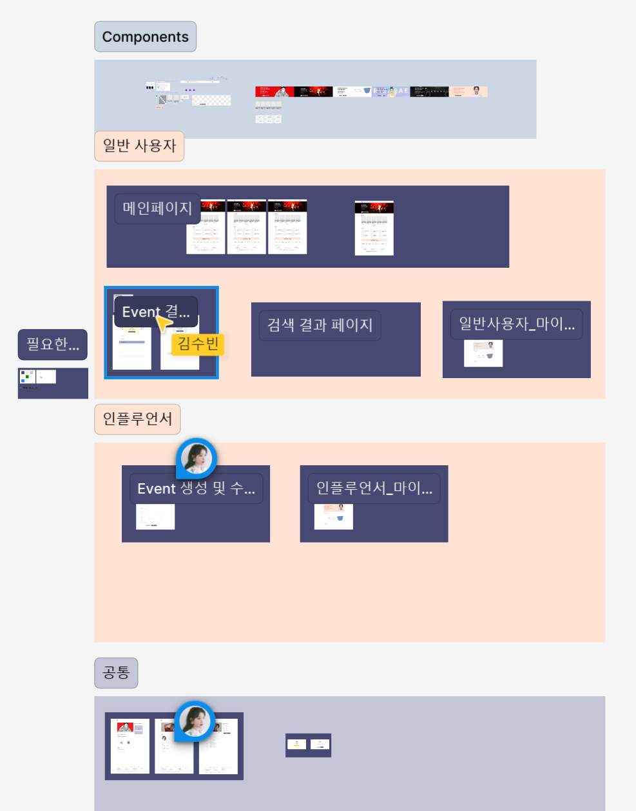

# Figma 디자인 소개

이번 프로젝트에서는 **Figma**를 사용하여 다음과 같은 핵심 페이지의 UI/UX 디자인을 진행하였습니다:

- **메인 페이지**: 사용자들이 이벤트를 쉽게 파악하고 참여할 수 있도록 주요 이벤트 목록과 실시간 정보를 표시합니다.
- **마이 페이지**: 개인화된 이벤트 관리 및 참여 내역 확인이 가능하며, 사용자 맞춤형 설정을 제공합니다.
- **검색 페이지**: 다양한 이벤트를 필터링 및 탐색할 수 있어 사용자 편의성을 높였습니다.
- **이벤트 페이지**: 이벤트 설명 및 참여 방법을 직관적으로 제공하며, 실시간 경쟁이 가능한 환경으로 디자인하였습니다.
- **결과 페이지**: 당첨 여부와 순위를 즉각적으로 확인할 수 있으며, 상세한 참여 정보와 피드백을 표시합니다.

### 디자인 이미지

