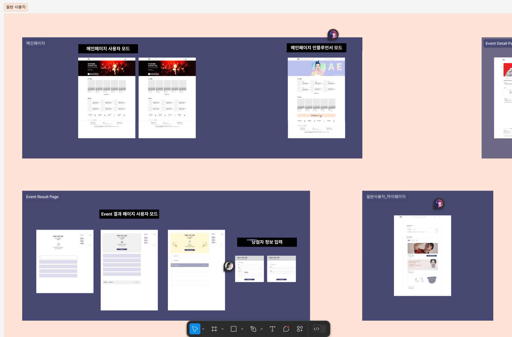

# 241031 Hwarang Daily Commit

## Figma 디자인 공유

- **Figma 디자인 URL**: [Figma 링크](https://www.figma.com/design/V7ujG4ifSxx4Gn5pgnfQy5/404DreamSolutions?node-id=0-1&t=hF9J6cH0QrQGZ6KS-1)
- Figma를 사용하여 UI/UX 디자인을 구현했습니다. 디자인 작업을 통해 사용자 경험을 최적화하고, 효율적인 컴포넌트 구성과 레이아웃 설계를 위해 Figma의 다양한 기능을 활용했습니다.

## Next.js 학습 내용

Next.js는 React 기반의 프레임워크로, 서버사이드 렌더링과 정적 생성 기능을 통해 최적화된 웹 애플리케이션을 개발할 수 있도록 돕습니다. Next.js에 대해 학습한 주요 내용은 다음과 같습니다.

1. **서버사이드 렌더링 (SSR)**: 페이지 로딩 시 서버에서 HTML을 생성하여 사용자에게 더 빠른 로딩 속도를 제공합니다.
2. **정적 생성 (Static Generation)**: 사전에 HTML을 생성하여 서버 부하를 줄이고 성능을 높입니다.
3. **API 라우팅**: Next.js에서는 API를 쉽게 생성하여 프론트엔드와 백엔드의 통신을 구현할 수 있습니다.
4. **이미지 최적화**: Next.js의 `Image` 컴포넌트를 통해 이미지 크기를 조절하고 최적화하여 빠른 로딩을 지원합니다.
5. **동적 경로**: `getStaticPaths`와 `getStaticProps`를 이용하여 동적 페이지 생성과 관련된 내용을 학습했습니다.

Next.js의 이러한 기능을 통해 React 애플리케이션의 SEO를 개선하고, 사용자에게 더 나은 성능을 제공할 수 있는 방법을 익혔습니다.
