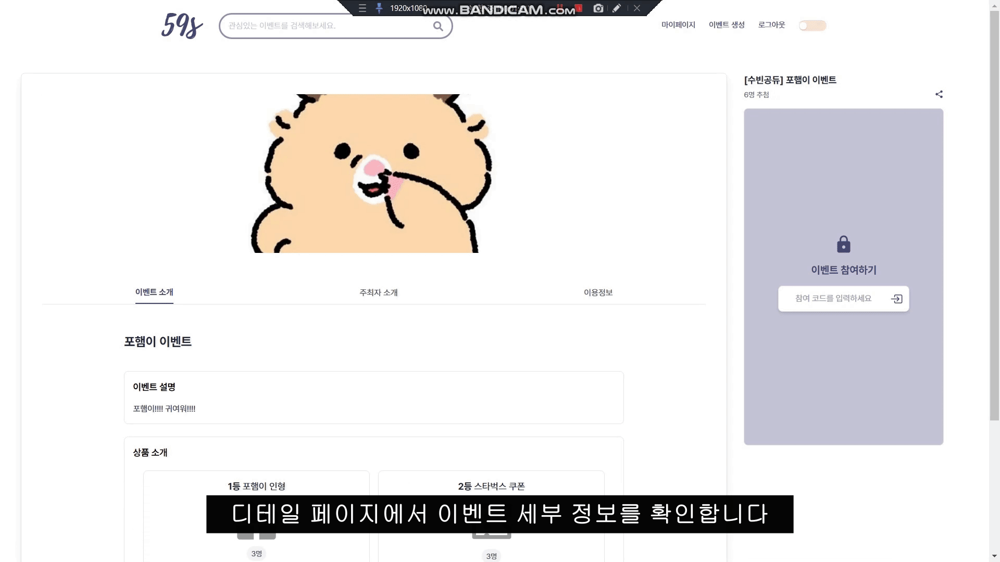
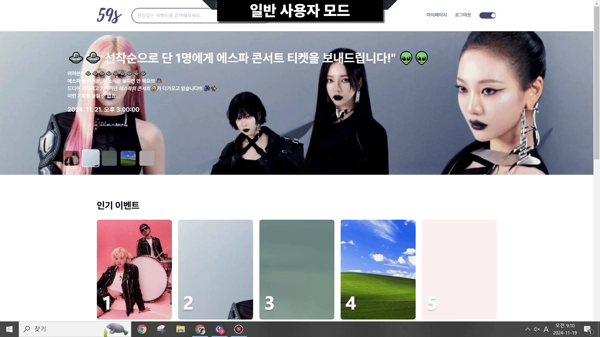
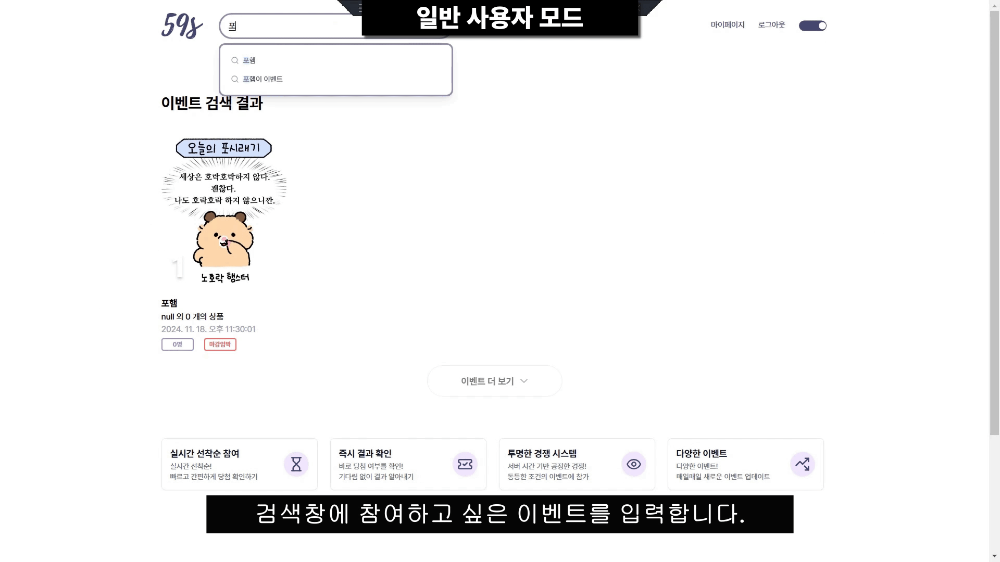
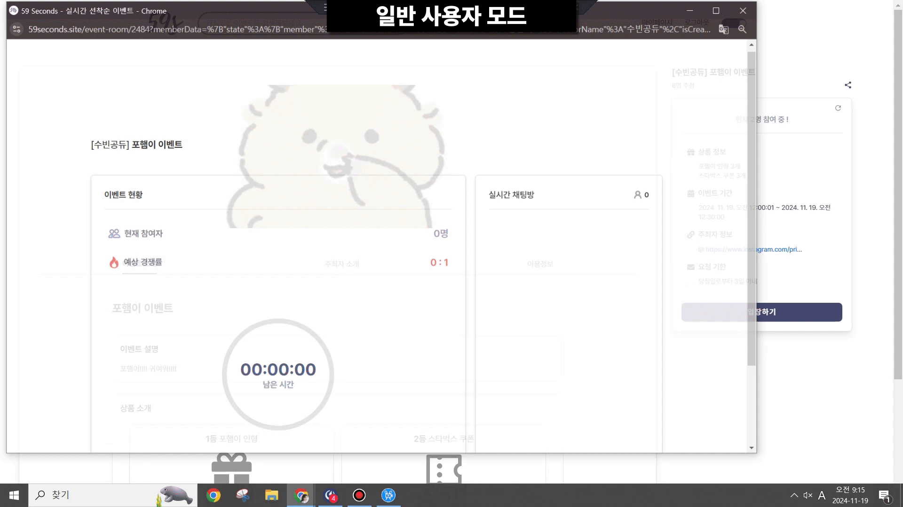
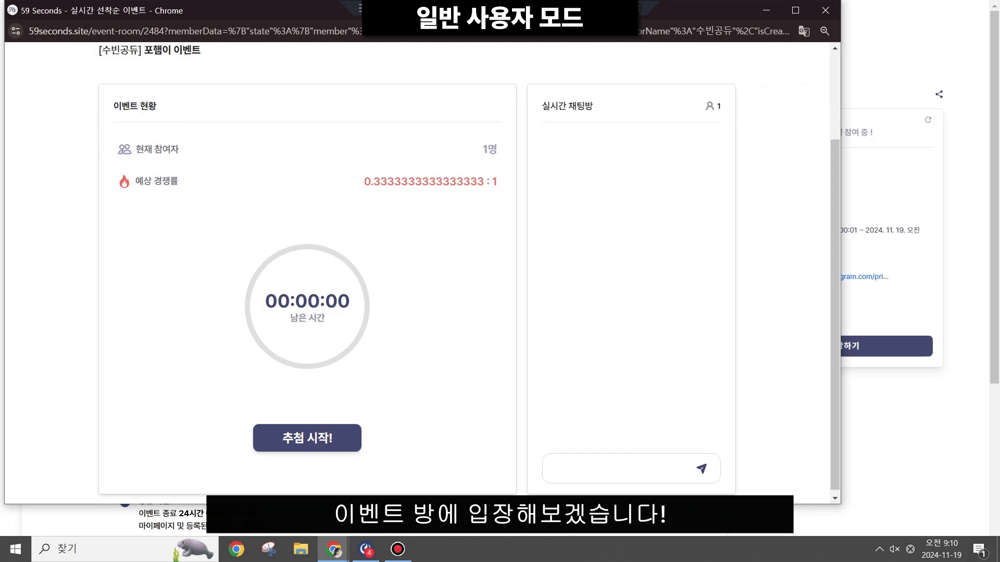
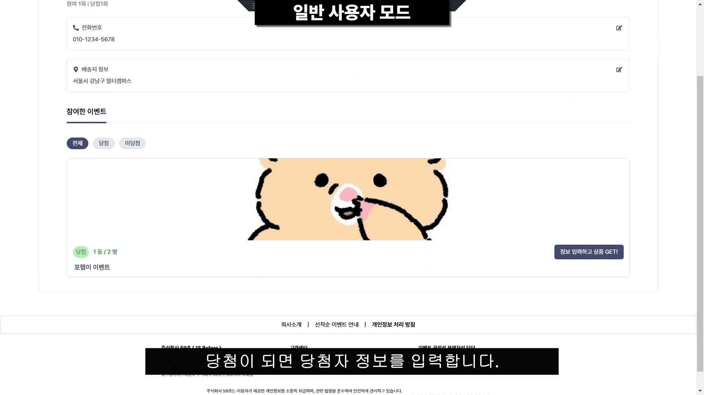
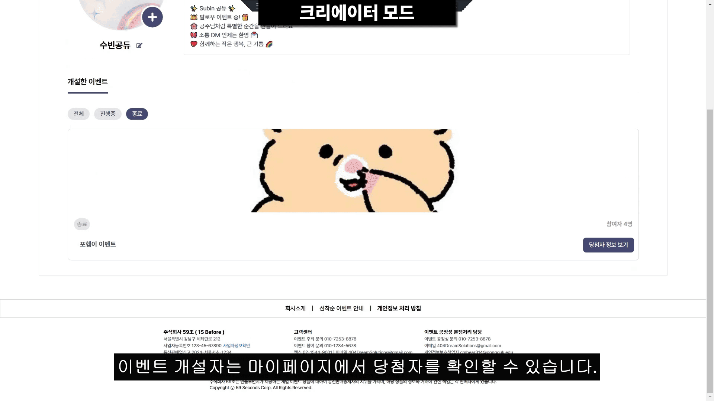

# **59초 (1 Second Before)**

**"공정성과 투명성을 갖춘 선착순 이벤트 서비스"**

<!-- 

 -->

59초는 선착순 이벤트 참여 과정에서 발생하는 불투명성을 해소하고, 사용자에게 자신의 순위와 참여 시간을 실시간으로 제공하는 플랫폼입니다.  
서비스의 실시간성과 공정성을 지원하기 위해 대규모 트래픽 처리와 동시성 문제를 해결하는 Dream Solution입니다.

---

## 📑 목차

1. [프로젝트 개요](#프로젝트-개요)
2. [기획 배경](#기획-배경)
   - 기존 플랫폼 문제점 및 개선 필요성
   - Dream Solution
3. [서비스 차별성](#서비스-차별성)
4. [기술 차별성](#기술-차별성)
5. [아키텍처](#아키텍처)
   - 모놀리틱 구조
   - MSA 구조
6. [주요 화면](#주요-화면)
7. [성능 테스트 결과](#성능-테스트-결과)
8. [사용 기술 스택](#사용-기술-스택)
9. [결론 및 차별성 요약](#결론-및-차별성-요약)

## **📌 프로젝트 개요**

- **프로젝트 이름**: 59초 (1 Second Before)
- **프로젝트 기간**: 2024년 10월 14일 - 2024년 11월 19일
- **목적**:
  - 사용자가 선착순 이벤트 참여 과정에서 자신의 **순위**와 **참여 시간**을 명확히 알 수 있도록 제공.
  - 공정성을 기반으로 한 이벤트 참여 환경 조성.
- **주요 기능**:
  - 실시간 순위 제공
  - 순위 대기 중 사용자 간 채팅 기능 제공
  - 클릭 시간 및 순위 데이터 저장 및 분석

---

## **🎯 기획 배경**

### **기존 플랫폼 문제점 및 개선 필요성**

#### 기존 선착순 이벤트 플랫폼의 문제점

1. **비효율적인 이벤트 운영**

   - 이벤트 주최자가 **모든 댓글을 읽고 추첨**해야 하는 불편함과 비효율성 존재.

2. **공정성과 신뢰성 부족**

   - 댓글 기반 추첨 방식은 **이미 당첨자가 정해져 있는 것 같다**는 부정적 인식을 조장.
   - 참여자들 사이에서 공정성과 투명성 부족으로 인해 신뢰가 저하됨.

3. **개인 정보 노출 및 보안 문제**
   - 당첨자를 특정하기 위해 **모든 참여자의 개인 정보를 수집**해야 하는 구조로, 사용자들이 거부감을 느끼게 됨.

---

### **우리 서비스의 Dream Solution**

#### 주요 차별점 및 개선 사항

1. **실시간 경쟁 도입**

   - 이벤트에 **실시간 경쟁 요소**를 추가하여, 공정성과 투명성을 극대화.
   - 특정 시점에 경쟁이 이뤄지도록 하여 참여자 간 공평한 기회를 보장.

2. **즉시 결과 확인**

   - 이벤트 종료와 동시에 **당첨 결과를 즉시 확인 가능**, 지연 없는 빠른 피드백 제공.

3. **투명한 프로세스**

   - 서버 시간을 기준으로 **랭킹과 당첨 여부를 명확히 표시**하여 신뢰도 향상.
   - 모든 참여자와 이벤트 생성자가 시스템을 통해 투명한 과정 확인 가능.

4. **이벤트 생성자와 참여자 페이지 분리**
   - 주최자와 참여자를 위한 각각의 전용 인터페이스 제공.
   - 주최자는 **이벤트 생성 및 관리**에 최적화된 UI를, 참여자는 **실시간으로 이벤트 참여 및 결과 확인**에 최적화된 UI를 사용할 수 있음.

---

## **🚀 서비스 차별성**

### **1) 기존 티켓팅과의 차별성**

- 기존의 티켓팅/이벤트 시스템은 참여자의 **순위**와 **응답 시간**을 공개하지 않음.
- 59초는 실시간으로 자신의 순위와 다른 참여자들의 클릭 시간을 확인할 수 있어, 공정성과 투명성을 보장.
- 사용자 간 실시간 채팅 기능을 통해 대기 중에도 **참여 경험**을 향상.

### **2) 실시간성에 특화된 아키텍처**

- 대규모 트래픽 처리와 동시성 문제를 고려해 **웹소켓(WebSocket)** 기술을 도입.
- 실시간 순위 데이터와 채팅 데이터를 **효율적으로 분리**하여 클라이언트에 제공.

---

## **🛠️ 기술 차별성**

### **1) 대규모 트래픽 처리 아키텍처**

#### **모놀리틱(Monolithic) 구조**

- 초기에는 모든 기능을 단일 서버에서 처리하여 빠르게 개발 및 테스트 진행.
- **성능 테스트 결과**: 초당 **1,500명** 처리 가능.

#### **MSA(Microservices Architecture)로 전환**

- 이벤트 선착순 로직을 별도 서비스로 분리하여 독립적으로 확장 가능하도록 설계.
- 채팅 서비스도 분리하여 **비동기 처리**로 서버 부하 감소.
- **성능 테스트 결과**: 초당 **3,500명 이상** 동시 처리 가능.

### **2) Redis 기반 동시성 처리**

- **Redis 분산락**을 활용하여 이벤트 참여 시 발생하는 동시성 문제 해결.
- 다수의 사용자가 동일한 자원(순위 데이터)에 접근하더라도 데이터 무결성을 유지.

### **3) 실시간 순위와 채팅 기능**

- **웹소켓(WebSocket)**을 사용하여 클라이언트와 서버 간 **양방향 실시간 통신** 구현.
  - 순위 데이터는 **밀리초 단위**로 업데이트되어 사용자에게 정확한 정보를 제공.
  - 채팅 메시지는 **낮은 레이턴시**로 전송되어 대기자 간 원활한 소통 지원.

---

## **🖼️ 아키텍처**

아키텍처 설계는 초기 모놀리틱에서 MSA로 전환하여 성능과 확장성을 최적화했습니다.

### **1) 모놀리틱 구조**

- **초기 설계**: 모든 기능(순위 처리, 채팅, 유저 관리)을 단일 애플리케이션에서 구현.
- **성능**:
  - 초당 **1,000명**의 트래픽을 처리 가능(K6 테스트 기준).
- **한계**:
  - 기능 확장 시 단일 서버의 부하 증가.
  - 채팅과 순위 처리가 엉켜 대기 시간이 증가할 가능성.

### **2) MSA 구조로 전환**

- **이벤트 처리 서비스**와 **채팅 서비스**를 별도로 분리.
  - 이벤트 처리 로직은 비동기로 동작하며, Redis를 통해 요청을 관리.
  - 채팅은 독립적인 웹소켓 서버에서 처리.
- **성능**:
  - 초당 **3,400명 이상** 처리 가능(K6 테스트 기준).
- **이점**:
  - 기능 확장 및 유지보수가 용이.
  - 각 서비스가 독립적으로 확장 가능.

---

## **주요 화면**

### 사용자 공통 화면

|                로그인 및 토글 전환                |                이벤트 상세 페이지                 |
| :-----------------------------------------------: | :-----------------------------------------------: |
|  |  |

### 일반 사용자 모드

|                    마이페이지                    |                        검색창                        |
| :----------------------------------------------: | :--------------------------------------------------: |
|  |  |

|                      이벤트 참여 (당첨)                      |                      이벤트 참여 (미당첨)                      |
| :----------------------------------------------------------: | :------------------------------------------------------------: |
|  |  |

|                      당첨자 정보 입력                      |
| :--------------------------------------------------------: |
|  |

### 크리에이터 모드

|                     이벤트 생성                      |                          당첨자 확인                          |
| :--------------------------------------------------: | :-----------------------------------------------------------: |
|  |  |

## **📊 성능 테스트 결과**

### **1) K6 성능 테스트**

#### **모놀리틱 구조**

- 초당 처리 가능 요청 수: **1,000명**
- 테스트 환경: 단일 서버, 4 vCPU, 8GB RAM

#### **MSA 구조**

- 초당 처리 가능 요청 수: **2,000명 이상**
- 테스트 환경: 다중 서버, Redis 캐싱 활용, 비동기 처리를 통한 성능 최적화

### **2) Redis 분산락 성능**

- **Lock 획득/해제 평균 시간**: **1ms 이하**
- 6,000명 이상이 동시에 접근하는 환경에서도 데이터 충돌 없이 순위 데이터를 처리.

---

## **🛠️ 사용 기술 스택**

| **분류**         | **사용 기술**          |
| ---------------- | ---------------------- |
| **프론트엔드**   | Next.js, WebSocket API |
| **백엔드**       | Spring Boot            |
| **데이터베이스** | MySQL, Redis           |
| **테스트**       | K6                     |
| **배포**         | AWS, Docker            |

---

## **💡 결론 및 차별성 요약**

59초는 다음과 같은 기술적 강점을 바탕으로 독창적이고 실시간성에 최적화된 서비스를 제공합니다:

1. **실시간 순위 제공**: 밀리초 단위로 업데이트되는 정밀한 순위 데이터를 제공.
2. **대규모 트래픽 처리**: Redis와 MSA를 활용해 초당 2,000명 이상 처리 가능.
3. **실시간 채팅**: 웹소켓 기반으로 낮은 레이턴시의 실시간 대화 지원.
4. **투명성과 공정성**: 모든 데이터를 사용자에게 투명하게 공개.

---
